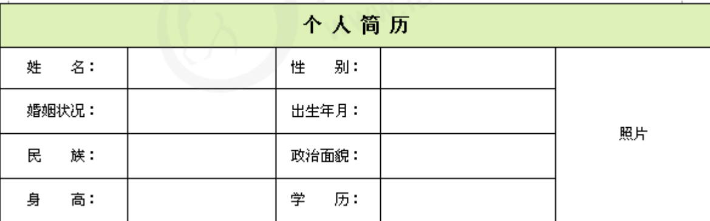

# HTML1

### 1. 基本概念

#### 		1.1什么是网页

​		网页是网站中的一页，通常是HTML格式的文件，通过浏览器来阅读；

​		网页是网站的基本元素，它通常由图片、文字、链接、文本、声音、视频等元素组成。通常我们看到的网页，常见以.html或.htm结尾，因此俗称HTML文件；

#### 		1.2什么是HTML

​		HTML指的是**超文本标记语言（Hyper Text Markup Language）**，它是用来描述网页的一种语言；

​		HTML不是一种编程语言，而是一种标记语言（Markup Language）;

​		超文本，即超出了传统的文本限制，可以加入动画、图片、多媒体等；

### 2. 浏览器内核

​		浏览器内核：负责读取网页的内容，整理讯息，计算网页的显示方式并显示页面；

| 浏览器       | 内核    | 说明                                 |
| ------------ | ------- | ------------------------------------ |
| IE           | Trident | IE、猎豹、360急速浏览器、百度等      |
| firefox      | Gecko   | 火狐内核                             |
| safari       | Webkit  | 苹果内核                             |
| chrome/Opera | Blink   | 谷歌、opera，Blink其实是Webkit的分支 |

​	目前国内一般浏览器采用的都是Webkit/Blink内核，如360、QQ、搜狗等。

### 3.Web标准

	#### 	3.1 标准的重要性

​	由于不同的浏览器解析出来页面效果可能不同，开发者常常需要为多版本的开发而费时费力，因此W3C(万维者联盟)就出了一套标准；

#### 		3.2 Web 标准的构成

​	主要包括结构、表现和行为三个方面；

| 标准 | 内容                                                |
| ---- | --------------------------------------------------- |
| 结构 | 用于对网页元素进行整理和分类，主要由HTML构成        |
| 表现 | 用于网页元素的板式、颜色、大小等外观，主要指的是CSS |
| 行为 | 用于网页模型定义和交互，主要由JavaScript来实现      |

### 4. HMTL基本结构标签

	#### 	4.1 骨架标签

```html
<!--文档类型的声明标签 -->
<!DOCTYPE html>
<!--  lang="en",当前文档的显示语言，en英文，zh-CN中文-->
<!-- html外部骨架 -->
<html lang="zh-CN">
    <!-- head显示头部信息，即浏览器头部的内容 -->
<head>
    <!-- 字符编码是UTF-8 -->
    <meta charset="UTF-8">
    <!-- 辩题信息 -->
    <title>标题</title>
</head>
<!-- body表示内容，网页的正文都在这里 -->
<body>
    hello,world!
</body>
</html>
```

 		#### 		4.2 标题标签

  - 标签：h1-h6

  - 示例

    ```html
     <!-- 标题标签独占一行，h1-h6依次变小 -->
        <h1>一级标题</h1>
        <h2>二级标题</h2>
        <h3>三级标题</h3>
        <h4>四级标题</h4>
        <h5>五级标题</h5>
        <h6>六级标题</h6>
    ```

    ####4.3 段落标签

- 标签：p

- 示例：

  ```html
  <!-- 段落标签 p ,两个p之间自动会隔行 -->
      <p>专家解释，中国的农历规定大月30天，小月29天，
          一年12个月共354或355天，比一个回归年的天数少11天左右，4年下来，就少了1个多月。久之，就会出现时序和天时错乱的怪现象。</p>
      <p>为了解决这个问题，便采用增加“闰月”的办法。今年闰月出现在6月，不仅七夕节推迟，中秋节也跟着错后，加之农历中秋节一般出现在阳历9月7日至10月6日之间，从而出现了中秋逢国庆的历法现象。</p>
  ```

  #### 4.4 换行标签

- 标签：br

- 示例

  ```html
  一年12个月共354或355天，<br/>比一个回归年的天数少11天左右，4年下来，就少了1个多月
  ```

  #### 4.5 文本格式化标签

  | 语义   | 标签                           | 说明                 |
  | ------ | ------------------------------ | -------------------- |
  | 加粗   | `<strong></strong>`或者<b></b> | 推荐前者，语义更强烈 |
  | 倾斜   | <em></em>或者<i></i>           | 推荐前者，语义更强烈 |
  | 删除线 | <del></del>或者<s></s>         | 推荐前者，语义更强烈 |
  | 下划线 | <ins></ins>或者<u></u>         | 推荐前者，语义更强烈 |

  #### 4.6 div和span标签

- div和span标签没有具体的语义，他们就是一个盒子，用来装内容的；

- div表示分割、分区，span表示跨度，跨距；

- 特点：

  - div用来布局的话，一行只能放一个div
  - span用来布局的话，一行可以放多个

  ```html
   <!-- div标签-->
       <div>我的div</div>
       <!-- span标签 -->
       <span>我是span</span>
       <span>我是span</span>
  ```

  #### 4.7 图像标签

- 标签用于定义html中的图像；

- 语法：``,src为img标签的必要属性；

- 其他属性：

  | 属性   | 值   | 说明                                 |
  | ------ | ---- | ------------------------------------ |
  | src    | 路径 | 必须属性                             |
  | alt    | 文本 | 图像不能正常显示显示的文本           |
  | title  | 文本 | 提示文本，鼠标放到图片上后显示的文本 |
  | width  | 像素 | 宽度                                 |
  | height | 像素 | 高度                                 |
  | border | 像素 | 边框粗细                             |

  ```html
   <!-- 图片标签 -->
  
  ```

  #### 4.8 超链接标签

- 在HMTL中，<a>标签作用于定义超链接，作用是从一个页面链接到另外一个页面。

  | 属性   | 作用                                                  |
  | ------ | ----------------------------------------------------- |
  | href   | 用于指定链接目标的url,必须属性                        |
  | target | 表示打开方式，_self为默认值，_blank表示在新的窗口打开 |

- 作用

  - 外部链接：: 例如 < a href="http:// www.baidu.com "> 百度

  - 内部链接：:网站内部页面之间的相互链接. 直接链接内部页面名称即可，例如 < a href="index.html"> 首页 

  - 空连接：空链接: 如果当时没有确定链接目标时，< a href="#"> 首页  

  - 下载链接：下载链接: 如果 href 里面地址是一个文件或者压缩包，会下载这个文件

  - 网页元素链接: 在网页中的各种网页元素，如文本、图像、表格、音频、视频等都可以添加超链接

  - 锚点链接: 点我们点击链接,可以快速定位到页面中的某个位置

    - 在链接文本的 href 属性中，设置属性值为 #名字 的形式，如`<a href="#two">第二集</a>`
    - 找到目标位置标签，里面添加一个 id 属性 = 刚才的名字 ，如：`<h3 id="two">第二集介绍</h3>`

    ```html
     <!-- 链接标签 -->
        <a href="http://www.baidu.com" target="_self">在本页面打开</a>
        <a href="http://www.baidu.com" target="_blank">在新页面打开</a>
        <a href="#two">第二集信息</a>
        <div id="two">第二集介绍</div>
    ```


  #### 4.9表格标签

- 表格主要用于显示、展示数据，因为它可以让数据显示的非常规整，可读性好。总之，表格不是来布局页面的，就是用来展示数据的。

- 基本语法：

  ```html
  <table>
      <tr>
          <td>文字展示</td>
      </tr>
  </table>
  ```

  - `<table></table>`标签主要用来定义表格的；
  - `<tr></tr>`标签主要是用来定义表格中的行，一行就是一个`tr`,必须包含在`<table></table>`标签中；
  - `<td></td>`标签主要是用来定义单元格的，必须包含在`<tr></tr>`中；

- 表格的属性

  | 属性名      | 属性值              | 描述                                         |
  | ----------- | ------------------- | -------------------------------------------- |
  | align       | left、center、right | 规定表格相对周围元素的对齐方式               |
  | border      | 1或""               | 规定表格是否带有边框，默认是""，表示没有边框 |
  | cellpadding | 像素值              | 规定单元边沿与其内容之间的空白，默认1像素    |
  | cellspacing | 像素值              | 规定单元格之间的空白，默认2像素              |
  | width       | 像素值或百分比      | 规定表格的宽度                               |

  ```html
      <table align="center" border="1px" cellspacing="0px" cellpadding="0px">
          <!-- thead表格表头 -->
          <thead>
              <tr>
                  <th>排名</th>
                  <th>关键字</th>
                  <th>趋势</th>
                  <th>今日搜索</th>
                  <th>最近7日</th>
                  <th>相关链接</th>
              </tr>
          </thead>
          <!-- tbody表格表体 -->
          <tbody>
              <tr align="center">
                  <td>1</td>
                  <td>鬼吹灯</td>
                  <td>趋势</td>
                  <td>345</td>
                  <td>123</td>
                  <td>
                      <a href="#">贴吧</a>
                      <a href="#">百度</a>
                      <a href="#">百科</a>
                  </td>
              </tr>
              <tr align="center">
                  <td>2</td>
                  <td>盗墓笔记</td>
                  <td>趋势</td>
                  <td>345</td>
                  <td>123</td>
                  <td>
                      <a href="#">贴吧</a>
                      <a href="#">百度</a>
                      <a href="#">百科</a>
                  </td>
              </tr>
              <tr align="center">
                  <td>3</td>
                  <td>西游记</td>
                  <td>趋势</td>
                  <td>345</td>
                  <td>123</td>
                  <td>
                      <a href="#">贴吧</a>
                      <a href="#">百度</a>
                      <a href="#">百科</a>
                  </td>
              </tr>
              <tr align="center">
                  <td>4</td>
                  <td>东游记</td>
                  <td>趋势</td>
                  <td>345</td>
                  <td>123</td>
                  <td>
                      <a href="#">贴吧</a>
                      <a href="#">百度</a>
                      <a href="#">百科</a>
                  </td>
              </tr>
              <tr align="center">
                  <td>5</td>
                  <td>南游记</td>
                  <td>趋势</td>
                  <td>345</td>
                  <td>123</td>
                  <td>
                      <a href="#">贴吧</a>
                      <a href="#">百度</a>
                      <a href="#">百科</a>
                  </td>
              </tr>
          </tbody>
      </table>
  ```

- 在一些情况下，还有可以进行单元格合并，比如下图

  

- 合并单元格方式

  - 跨行合并：rowspan="合并单元格的个数";
  - 跨列合并：colspan="合并单元格的个数";

  #### 5.0 列表标签

  表格是用来显示数据的，列表就是用来布局的；

  列表的最大特点就是整齐、整洁、有序，它作为布局会更加自由和方便；

  根据使用的情景不同，列表可以分为三大类：无序列表、有序列表和自定义列表；

  ##### 5.0.1 无序列表

- `ul`标签标示HTML页面中项目的无序列表，一般会以项目符号呈现列表项，而列表项使用`<li>`标签定义；

- 语法：

  ```html
   <ul>
          <li>列表1</li>
          <li>列表2</li>
          <li>列表3</li>
      </ul>
  ```

- 特点

  1. 无序列表的各个列表项之间没有顺序级别之分，是并列的；
  2. `<ul></ul>`中只能嵌套`<li></li>`；
  3. `<li></li>`之间相当于一个容器，可以容纳所有元素;

  ##### 5.0.2 有序列表

- 有序列表就是有排列顺序的列表，其中各个列表项会按照一个的顺序排列定义；

- 在HTML标签中，`<ol>`标签用于定义有序列表，列表排序以数字来显示，并且使用`<li>`标签来定义列表；

- 语法：

  ```html
  <ol>
          <li>列表1</li>
          <li>列表2</li>
          <li>列表3</li>
      </ol>
  ```

- 特点

  1. `<ol></ol>`中只能嵌套`<li></li>`；
  2. `<li></li>`之间相当于一个容器，可以容纳所有元素;

  ##### 5.0.3 自定义列表

- 自定义列表常用于对属于或名词进行解释，定义列表的列表项没有任何项目符号；

- 语法：

  - 在HTML标签中，`<dl>`标签用于定义描述列表，该标签会与`<dt>`（定义项目名字）和`<dd>`（描述项目的每一个名字）一起使用；

- 特点:

  1. `<dl></dl>`中只能包含`<dt>`和`<dd>`;
  2. `<dt>`和`<dd>`的个数没有限制，经常是一个`<dt>`对应多个`<dd>`;

  #### 5.1 表单

  在HTML中，一个完整的表单通常由表单域、表单控件和提示信息3个部分组成；

  #### 5.1.1 表单域

- 表单域是一个包含表单元素的区域；

- 在html中，`<form>`标签用于定义表单域，以实现用户信息的收集和传递；

- `<form>`会把它范围内的表单元素信息提交给服务器；

  ```html
  <form action=“url地址” method=“提交方式” name=“表单域名称">
  <!-- 表单 -->
  </form>
  ```

- 常用属性

  | 属性   | 属性值   | 作用                                               |
  | ------ | -------- | -------------------------------------------------- |
  | action | url地址  | 用于携带表单内容请求服务器地址                     |
  | method | get/post | 用于定义请求方式                                   |
  | name   | 名词     | 用于指定表单的名词，以区分同一个页面中的多个表单域 |

  #### 5.1.2 Input标签

- `<input>`标签用于接收用户信息；

- `<input>`标签中，包含一个type属性，根据不同的type属性值，输入字段有很多种形式，可以是文本，可以是复选框，可以是掩码后的文本控件，单选按钮，按钮等；

  ```html
  <input type="属性值" />  <!-- 单标签 -- >
  ```

  - type 属性的取值如下：

    | 属性值   | 作用                                                 |
    | -------- | :--------------------------------------------------- |
    | button   | 定义可点击的按钮                                     |
    | checkbox | 定义复选框                                           |
    | file     | 定义输入字段和浏览按钮，供文件上传使用               |
    | hidden   | 隐藏输入字段                                         |
    | image    | 定义图像形式的提交按钮                               |
    | password | 定义密码字段，掩码                                   |
    | redio    | 定义单选按钮                                         |
    | submit   | 定义提交按钮，将表单数据发到服务器                   |
    | text     | 定义单行的输入字段，可以输入文本，默认宽度为20个字段 |

- 除了type属性外，还有其他属性，如下：

  | 属性      | 属性值     | 描述                         |
  | --------- | ---------- | ---------------------------- |
  | name      | 用户自定义 | 定义名词                     |
  | value     | 用户自定义 | 定义值                       |
  | checked   | checked    | 首次加载时被选中             |
  | maxlength | 正整数     | 规定输入字段中字符的最大长度 |

  - 注意事项：
    1. name和value是每个表单圆度都有的属性值，主要给后台人员使用；
    2. name表单元素名字，要求按钮和复选框要有相同的name值；
    3. checked 属性主要针对于单选按钮和复选框，主要用作是一打开页面，就被选择到；
    4. maxlength是用户可以在表单输入的最大字符数；

  #### 5.1.3  label标签

- `label`标签为input元素定义标注；

- `<label>`标签的作用是用于绑定一个表单元素，当点击`label`标签内的文本时，浏览器会自动将焦点转到对应的表单元素上，增加用户体验；

  ```html
  <label for="sex">男</label>
  <input type="radio" name="sex" id="sex" />
  ```

- 注意：`<label>` 标签的for属性应当与需要绑定的元素的id属性一致；

  #### 5.1.4 select标签

- 在页面中，如果有多个选项让用户选择，可以使用`<select>`标签定义下拉列表；

- 语法：

  ```html
  <select>
   <option>选项1</option>
   <option>选项2</option>
   <option>选项3</option>
   ...
  </select>
  ```

- 注意：

  1. `<select>`中至少包含一对`<option>`;
  2. 在`</option>`中定义selected="selected"时，当前选项即为默认选中项；

  #### 5.1.5 文本域标签 textarea

- 当用户输入内容较多的情况下，我们就不能使用文本框表单了，此时我们可以使用`<textarea>`标签；

- 在表单元素中，`<textarea>`标签是用于定义多行文本输入的控件;

- 比如留言板，评论什么的；

- 语法：

  ```html
  <textarea rows="3" cols="20">
   文本内容
  </textarea>
  ```

  