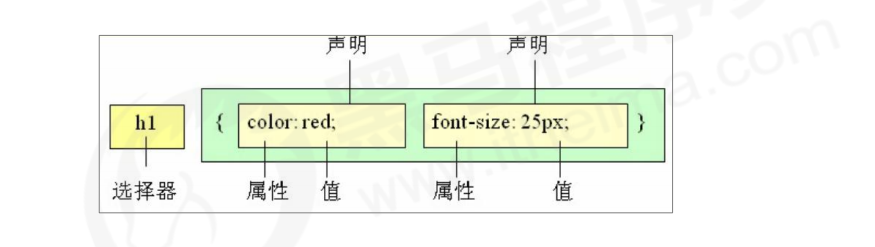
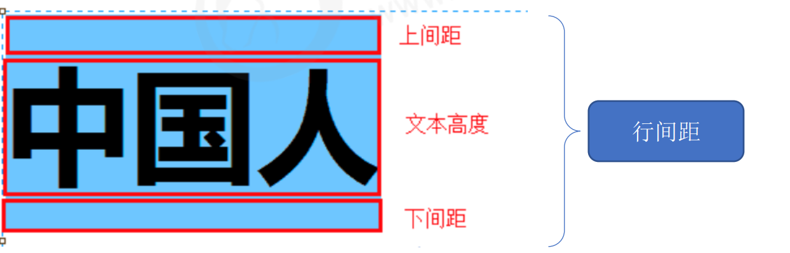

### CSS初级

#### 	1. CSS简介

 - CSS是层叠样式表（Cascading Style Sheets）的简称；

 - 也称为CSS样式表或级联样式表；

 - CSS也是一种标记语言；

 - CSS主要用于设置Html页面中的文本内容（字体、大小、对齐方式等），图片的外形，版面的布局或外观显示样式；

 - CSS让网页更加丰富，布局更加灵活；

   #### 2.CSS语法规范

- CSS顾泽由两个主要的部分构成：选择器以及一条或多条声明；

- 选择器是用于指定CSS样式的HTML标签，花括号内是该对象设置的具体样式；

- 花括号内属性和属性值以键值对的形式出现；

- 属性和属性值之间用冒号隔开；

- 多个键值对之间用英文分号隔开 ；

  

- 所有的样式，都包含在`<Style>`标签内，表示是样式表，`<style>`一般写在`</head>`上方；

  ```css
  <head>
   <style>
   h4 {
   color: blue;
   font-size: 100px;
   }
   </style>
  </head>
  ```

  #### 3. 基础选择器

  选择器就是根据不同需求把不同的标签选出来，简单的说就是选择标签的；

  基础选择器是由单个选择器构成的，包括：标签选择器、类选择器、id选择器和通配符选择器；

  ##### 3.1 标签选择器

- 标签选择器是指用HTML标签名词作为选择器，按照标签名词进行分类，为页面中某一类标签指定同一的CSS样式；

- 语法：

  ```
  标签名{
   属性1: 属性值1;
   属性2: 属性值2;
   属性3: 属性值3;
   ...
  } 
  ```

- 作用：可以把某一类的标签全部选择出来，比如所有的`<div>`标签；

- 优点：能够快速选择；

- 缺点：只能选全部的当前标签，不能体现出差异化；

  ##### 3.2 类选择器

- 如果想要差异化，单独选择一个或某几个标签，可以使用类选择器；

- 语法：

  ```css
  <div class=‘red’> 变红色 </div>
  ```

  类选择器在HTML中以class属性表示，但是在css中，类选择器以一个"."号显示；

- 注意事项：

  1. 类选择器使用"."进行标识，后面紧跟着类名；
  2. 可以理解为给这个标签起了一个名字；
  3. 长名称或词组中使用横线来为选择器命名；
  4. 不能使用纯数字、中文命名，尽量用英文命名；
  5. 命名要见明知意；

- 多类名使用：

  1. 在标签class中可以写多个类名；
  2. 多个类名之间用空格隔开；
  3. 这个标签就可以同时拥有这些类名的样式；

- 多类名选择器使用技巧：

  1. 可以把一些标签元素相同的样式（公共部分）放到一个类里面；
  2. 这些标签都可以调用这个公共的类，然后调用自己特有的类；
  3. 节省CSS代码，方便统一修改；

  ##### 3.3 Id选择器

- id选择器可以为标有特点id的html元素指定特定的样式；

- HTML元素以id属性类设置id选择器，CSS中id选择器以"#"来定义；

- 语法：

  ```
  #id名 {
   属性1: 属性值1;
   ...
  } 
  ```

- 注意：id属性在每个html文档中是唯一的，只能出现一次；

  ##### 3.4 通配符选择器

- 在css中，*为通配符，表示选择页面中的所有元素；

- 语法：

  ```
  * {
   属性1: 属性值1;
   ...
  } 
  ```

- 通配符选择器自动给所有元素使用样式；

  ##### 3.5 小结

  | 基础选择器   | 作用                     | 特点                           | 使用情况     |
  | ------------ | ------------------------ | ------------------------------ | ------------ |
  | 标签选择器   | 可以选择出所有相同的标签 | 不能差异化选择                 | 多           |
  | 类选择器     | 可以选择出1个或多个标签  | 可以根据需求选择               | 很多         |
  | id选择器     | 一次只能选择1个标签      | id属性在一个html中只能出现一次 | 和js搭配使用 |
  | 通配符选择器 | 选择所有标签             | 全选，可能导致有的不需要       | 特殊情况使用 |

  #### 4. CSS字体属性

  CSS字体属性用于定义字体，比如粗细、大小和文字样式；

  ##### 4.1 字体系列

- CSS使用font-family属性定义文本的字体系列；

- 语法：

  ```html
          #family1{
              font-family: "仿宋";
          }
          #family2{
              font-family:  Arial,"Microsoft Yahei", "微软雅黑";
          }
         <span id="family1">字体系列1</span>
         <span id="family2">字体系列2</span>
  ```

  ##### 4.2 字体大小

- CSS使用font-size属性定义字体大小；

- 语法：

  ```html
   p{
              font-size: 28px;
    }
  <p>字体大小</p>
  ```

- 注意事项：

  1. px大小是网页最常用的单位；
  2. 谷歌浏览器默认的文字大小为16px;
  3. 可以给body指定整个页面文字的大小；

  ##### 4.3 字体粗细

- CSS中font-weight属性设置文字字体的粗细；

- 语法：

  ```html
   .weight{
              font-weight:800;
  }
  <p class="weight">字体粗细</p>
  ```

  | 属性值  | 描述                                         |
  | ------- | -------------------------------------------- |
  | normal  | 默认值                                       |
  | bold    | 定义粗体                                     |
  | 100-900 | 400等于normal，700等同于bold，数字后不跟单位 |

  ##### 4.4 文字样式

- CSS使用font-style属性设置文本的风格；

- 语法：

  ```html
  i{
              font-style: normal;
  }
  <i>斜体</i>
  ```

  | 属性值 | 作用                                 |
  | ------ | ------------------------------------ |
  | normal | 默认值，浏览器会显示标准的字体样式； |
  | italic | 斜体显示                             |

- 注意：平时很少给文字加斜体，反而要给斜体标签（em,i）改为不倾斜的字体；

  ##### 4.5 字体复合属性

- CSS中Fonts属性用于定义字体系列、大小、粗细、和文字样式；

- 字体属性可以把以上文字样式综合来写，节约代码；

- 示例：

  ```html
    /* 文字综合属性 */
          #all{
              /* font-style: italic;
              font-size: 30px;
              font-weight: 700;
              font-family: "微软雅黑"; */
              /* 综合写法 */
              font:italic 700 30px "微软雅黑"
          }
          <span id="all">综合属性</span>
  ```

- 注意：

  1. 使用font属性时，必须按照以上的顺序写，font-style，font-weight,font-size，font-family来写，属性之间空格隔开；
  2. 不需要的设置属性可以省略，但必须保留font-size和font-family，否则font属性不起作用；

  #### 5  文本属性

  CSS中Text属性可以定义文本外观，比如文本的颜色、对齐方式、装饰文本、行间距、缩进等；

  ##### 5.1 对齐方式

- test-align属性用于设置元素内文本内容的水平对齐方式；

- 示例：

  ```html
  div {
   text-align: center;
  }
  ```

  | 属性值 | 说明             |
  | ------ | ---------------- |
  | left   | 左对齐（默认值） |
  | right  | 右对齐           |
  | center | 居中对齐         |

  ##### 5.2 装饰文本

- text-decoration属性规定添加到文本的修饰，可以给文本添加下划线、删除线、上划线等；

- 示例

  ```html
   /* 文本装饰 */
          #a{
            text-decoration: underline;
          }
          #b{
             text-decoration: overline;
          }
          #c{
             text-decoration: line-through;
          }
           <p id="a">下划线</p>
           <p id="b">上划线</p>
           <p id="c">删除选</p>
  ```

  | 属性值       | 描述             |
  | ------------ | ---------------- |
  | none         | 默认。没有装饰线 |
  | underline    | 下划线           |
  | overline     | 上划线           |
  | line-through | 删除线           |

  ##### 5.3 文本缩进

- text-indent属性用来指定文本的第一行的缩进，通常是段落的首行缩进；

- 示例：

  ```html
   /* 文本缩进 */
          #aa{
              text-indent: 10px;
          }
          #bb{
              text-indent: 2em;
          }
         <div id="aa" >首行缩进1</div>
         <div id="bb">首行缩进2</div>
  ```

- 注意：em是一个相对单位，就是当前元素1个文字的大小，如果当前元素没有设置大小，则会按照父元素的1个文字的大小；

  ##### 5.4 行间距

- line-height属性用于设置行间的距离，可以控制文字与行之间的距离；

- 示例：

  ```html
   /* 行间距 */
          #cc{
              line-height:26px;
          }
    <div id="cc">CHINA</div>
  ```

  

- 例子中设置的26像素，谷歌默认16像素，所以上间距和下间距都是(26-10)/2 = 5像素；

#### 6 .CSS引入方式

​	按照CSS的书写的位置，CSS样式表可以分为三大类：

  1. 行内样式表（行内式）

  2. 内部样式表（嵌入式）

  3. 外部样式表（链接式）

     ##### 6.1 行内样式表

- 行内样式就是在元素标签内部的style属性中设定CSS样式，适合简单样式修改；

- 例子

  ```html
  <div style="color: red; font-size: 12px;">青春不常在，抓紧谈恋爱</div>
  ```

- 说明

  1. style就是标签的属性；
  2. 在双引号中，写合法的CSS规范；

  ##### 6.2 内部样式表

- 内部样式表（内嵌样式表）是写到html页面内部. 是将所有的 CSS 代码抽取出来，单独放到一个 `<style>`中；

- 例子

  ```CSS
  <style>
   div {
   color: red;
   font-size: 12px;
   }
  </style>
  
  ```

- 说明

  1. `<Style>`标签理论上可以放在html的任何地方，但是一般都会放在文档的`<head>`标签中；
  2. 这个方式可以方便控制页面中的样式设置；
  3. 代码结构虽然清晰了点，但是并没有实现结构和样式分离；

  ##### 6.3 外部样式表

- 样式单独写在CSS文件中，然后把CSS文件引入到HTML页面中；

- 步骤

  - 新建一个后缀为.css的样式文件，写所有的css代码；
  - 在html中，使用`<link>`标签引入文件；

  ```css
  <link rel="stylesheet" href="css文件路径">
  ```

  | 属性 | 作用                                                         |
  | ---- | ------------------------------------------------------------ |
  | rel  | 定义当前文档和被链接备档的关系，在这里需要指定为"stylesheet"，表示被链接的文档是一个样式表文件 |
  | herf | 定义被链接文件的utl，相对路径和绝对路径均可                  |

  ##### 6.4 小结

  | 样式表     | 优点                   | 缺点         | 使用情况 | 控制范围         |
  | ---------- | ---------------------- | ------------ | -------- | ---------------- |
  | 行内样式表 | 书写方便，权重高       | 结构样式混杂 | 较少     | 一个标签         |
  | 内部样式表 | 部分结构和样式分离     | 没有彻底分离 | 较多     | 一个页面         |
  | 外部样式表 | 完全实现结构和样式分离 | 需要引入     | 推荐     | 多个页面，可复用 |

  

