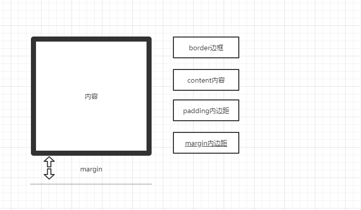

### 盒子模型

页面布局三大核心，盒子模型，浮动、定位；

### 1.盒子模型

#### 	1.1 网页布局的本质

- 网页布局的过程：

  - 准备好相关网页元素；
  - 利用CSS设置好盒子样式，摆放到对应位置；
  - 盒子里面填充内容；

- 网页布局的本质就是利用CSS摆放盒子；

  #### 1.2 盒子模型的组成

- 盒子模型：就是把hmtl页面中的布局元素看作是一个矩形的盒子，也就是一个承装内容的容器；

- CSS盒子模型本质上就是一个盒子，封装周围html元素，包括：边框、外边距、内边距和实际内容；

  

  #### 1.3 边框

- border可以设置元素的边框。边框有三部分组成：边框宽度，边框样式，边框颜色；

- 语法：	

  ```
  border:border-width || border-style || border-color
  ```

- border-style取值：

  - none：没有边框（默认）；
  - solid：边框为单实线；
  - dashed：边框为虚线；
  - dotted：边框为点线；

- 例子：

  ```css
  border:1px solid red; /*全边框*/
  ```

  ```css
  border-top:1px solid red; /*上边框*/
  ```

  ```html
   <style>
       #div{
           height: 200px;
           width: 200px;
           border: blue solid 1px;
           border-top: red solid 1px;
       }
     </style>
  <body>
      <div id="div"></div>
  </body>
  ```

  #### 1.4 内边距

- padding熟悉用于设置内边距，即边框与内容之间的距离；

  | 属性           | 作用     |
  | -------------- | -------- |
  | padding-left   | 左内边距 |
  | padding-right  | 右内边距 |
  | padding-top    | 上内边距 |
  | padding-bottom | 下内边距 |

- padding属性简写可以有一到四个值；

  | 值                          | 描述                                          |
  | --------------------------- | --------------------------------------------- |
  | padding:5px;                | 表示上下左右内边距都是5px                     |
  | padding:5px 10px;           | 表示上下内边距5px，左右内边距10px             |
  | padding:5px 10px 20px;      | 表示上内边距5px，左右内边距10px，下内边距20px |
  | padding:5px 10px 20px 30px; | 上5px,右10px,下20px，左30px,即顺时针          |

  #### 1.5 外边距

- margin属性用于设置外边距，即控制盒子和盒子之间的距离；

  | 属性          | 作用     |
  | ------------- | -------- |
  | margin-left   | 左外边界 |
  | margin-right  | 右外边距 |
  | margin-top    | 上外边距 |
  | margin-bottom | 下外边距 |

  ##### 1.5.1 外边距经典应用

  - 外边距可以让块级盒子水平居中，但是必须满足两个条件：

    1. 盒子必须指定了宽度；
    2. 盒子的左右外边距是auto;

    ```html
       /* margin让块级元素水平居中 */
         .div2{
            /* 设置宽度 */
             width: 500px;
             border: red solid 1px;
             /* 左右边距auto */
             margin: 0 auto;
         }
         <div class="div2">水平居中</div>
    ```

  - 语法和padding类似；

  ##### 1.5.2清除内外边界

   - 网页元素很多都带有默认的内外边距，不同的浏览器默认的也不一样。在布局前，要先清除下网页元素的内外边距；

     ```css
     * {
      padding:0; /* 清除内边距 */
      margin:0; /* 清除外边距 */
      }
     ```

  #### 2. 圆角边框

- CSS3中，新增了圆角边框，这样盒子就可以变圆角了；

- border-radius属性用于设置元素的外边框圆角；

- 语法:

  ```
  border-radius:参数;
  ```

- 参数可以为数值或百分比；

- 如果是正方形，想设置圆形，把数值设置成边长的一半，或者直接写50%；

- 该属性是一个简写的属性，可以跟4个值，分别代表左上角，右上角，右下角，左下角；

- 也可以分开写，border-top-left-radius、border-top-right-radius、border-bottom-right-radius 和

  border-bottom-left-radius；

  #### 3.盒子阴影

- CSS3中新增了盒子阴影，可以使用box-shadow属性为盒子添加阴影。

  | 值       | 描述                           |
  | -------- | ------------------------------ |
  | h-shadow | 必须。水平阴影位置，允许负值； |
  | v-shadow | 必须。垂直阴影位置，允许负值； |
  | blur     | 可选。模糊距离；               |
  | spread   | 可选。阴影的尺寸；             |
  | color    | 可选。阴影的颜色；             |
  | inset    | 可选。将外部阴影改为内部阴影； |

- 注意：默认的是外阴影（outSet），但是不可以写这个单词，否则造成阴影无效；

- 盒子阴影不占空间，不影响其他排列；

  ####  4.文字阴影

- CSS3中可以使用text-shadow属性为文本添加阴影。

  | 值       | 描述                           |
  | -------- | ------------------------------ |
  | h-shadow | 必须。水平阴影位置。允许负值； |
  | v-shadow | 必须。垂直阴影位置。允许负值； |
  | blur     | 可选。模糊的距离；             |
  | color    | 可选。阴影的颜色；             |